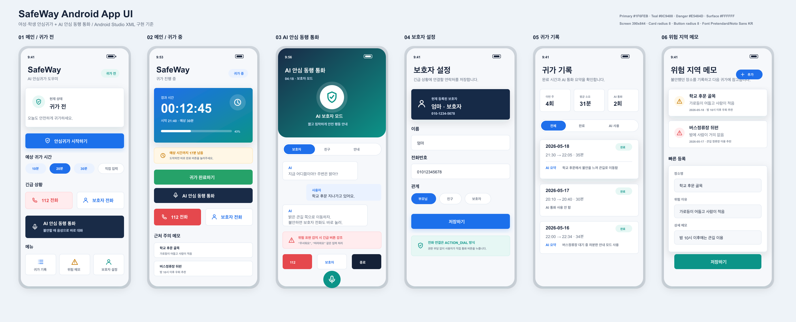
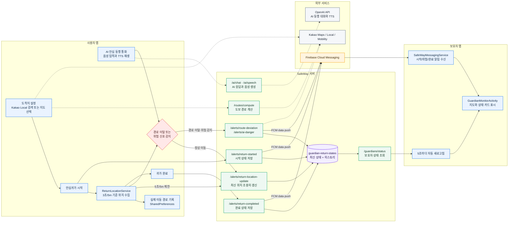

# SafeWay

여성·학생 안심귀가를 위한 Android 안전 동행 앱입니다. 사용자가 귀가를 시작하면 현재 위치와 도보 경로를 기록하고, 보호자는 별도 모니터 화면에서 사용자의 실시간 위치와 경로 상태를 확인할 수 있습니다.

<p align="center">
  
</p>

## 주요 기능

- 안심귀가 시작/완료 및 예상 귀가 시간 표시
- 보호자 연동 코드 생성과 FCM 토큰 기반 보호자 연결
- 안심귀가 중 사용자 실시간 위치 업데이트
- 보호자 모니터에서 현재 위치, 도착지, 경로, 최근 알림 확인
- 경로 이탈 감지 시 보호자에게 위험 알림 전송
- AI 안심 동행 통화 화면, 음성 입력, TTS 응답
- 위험 키워드 감지 및 112/보호자 연락 유도
- 카카오 지도 기반 도착지 검색, 현재 위치 표시, 도보 경로 표시
- 귀가 기록과 위험 지역 메모를 SQLite에 저장

## 동작 흐름



실시간 위치는 보호자 휴대폰에 푸시 알림을 계속 띄우지 않습니다. 사용자 기기가 위치를 서버에 갱신하고, 보호자 화면이 최신 상태를 자동 조회해 지도 위치를 갱신합니다.

| 흐름 | 처리 방식 |
| --- | --- |
| 시작/위험/완료 알림 | Firebase Cloud Messaging으로 보호자에게 즉시 전송 |
| 실시간 위치 | 사용자 앱이 서버에 조용히 갱신하고 보호자 앱이 5초마다 조회 |
| 이동 경로 기록 | 사용자 앱 내부에 실제 이동 좌표를 누적 저장 |
| 경로 이탈 | 기준 경로와 현재 위치의 거리 차이를 계산해 보호자에게 위험 알림 |

## 기술 스택

| 영역 | 사용 기술 |
| --- | --- |
| Android | Java, Kotlin, Android XML Layout, ViewBinding |
| 지도/경로 | Kakao Maps SDK v2, Kakao Local API, Kakao Mobility Walking Directions API |
| 백그라운드 위치 | Android Foreground Service, LocationManager |
| 보호자 알림 | Firebase Cloud Messaging, firebase-admin |
| 서버 | Node.js, Express |
| 데이터 저장 | SharedPreferences, SQLiteOpenHelper, JSON runtime state |
| 음성/AI | SpeechRecognizer, TextToSpeech, OpenAI API 연동용 서버 코드 |

## 프로젝트 구조

```text
SafeWay/
├── app/                  # Android 앱
│   ├── src/main/java/    # Activity, Service, client logic
│   ├── src/main/res/     # XML layouts, colors, drawables
│   ├── build.gradle
│   └── google-services.example.json
├── server/               # FCM, 경로 계산, AI 통화 API 서버
│   ├── src/index.js
│   ├── package.json
│   ├── .env.example
│   └── README.md
├── design/               # UI 시안과 기술 구성 이미지
├── gradle/               # Gradle wrapper
├── build.gradle
└── settings.gradle
```

## 실행 준비

### 1. Android 설정

Android Studio에서 프로젝트 루트 폴더를 열고 Gradle Sync를 실행합니다.

앱용 카카오 키는 루트의 `local.properties`에 넣습니다. 이 파일은 GitHub에 올리지 않습니다.

```properties
KAKAO_NATIVE_APP_KEY=your-kakao-native-app-key
KAKAO_REST_API_KEY=your-kakao-rest-api-key
```

Firebase Cloud Messaging을 사용하려면 Firebase Console에서 Android 앱 패키지명 `com.safeway.app`을 등록한 뒤, 내려받은 설정 파일을 아래 경로에 둡니다.

```text
app/google-services.json
```

저장소에는 실제 파일 대신 `app/google-services.example.json`만 포함합니다.

### 2. 서버 설정

```bash
cd server
npm install
cp .env.example .env
```

`server/.env`에 필요한 값을 채웁니다. 이 파일도 GitHub에 올리지 않습니다.

```env
PORT=8080
KAKAO_REST_API_KEY=your-kakao-rest-api-key
GOOGLE_APPLICATION_CREDENTIALS=/absolute/path/to/firebase-service-account.json
OPENAI_API_KEY=your-openai-api-key
```

Firebase Admin SDK는 서비스 계정 JSON 파일 경로나 `FIREBASE_SERVICE_ACCOUNT_JSON` 환경 변수 중 하나로 설정할 수 있습니다.

### 3. 실행

서버:

```bash
cd server
npm start
```

Android 앱 빌드:

```bash
./gradlew :app:assembleDebug
```

생성 APK:

```text
app/build/outputs/apk/debug/app-debug.apk
```

실제 휴대폰에서 로컬 서버를 테스트할 때는 `10.0.2.2` 대신 PC의 LAN IP 또는 `ngrok` 같은 HTTPS 터널 주소를 앱의 푸시 서버 주소에 입력합니다.

## 주요 API

| Method | Endpoint | 설명 |
| --- | --- | --- |
| `POST` | `/guardians/pairing-code` | 보호자 기기에서 6자리 연동 코드 생성 |
| `POST` | `/guardians/link` | 사용자 기기에서 보호자 연동 코드 등록 |
| `POST` | `/guardians/status` | 보호자 모니터가 최신 귀가 상태 조회 |
| `POST` | `/routes/compute` | 카카오 기반 도보 경로 계산 |
| `POST` | `/alerts/return-started` | 안심귀가 시작 알림 전송 |
| `POST` | `/alerts/return-location-update` | 안심귀가 중 실시간 위치 갱신 |
| `POST` | `/alerts/route-deviation` | 경로 이탈 알림 전송 |
| `POST` | `/alerts/return-completed` | 귀가 완료 알림 전송 |
| `POST` | `/ai/chat` | AI 안심 동행 대화 응답 |
| `POST` | `/ai/speech` | TTS 음성 응답 생성 |
| `POST` | `/ai/summary` | AI 통화 기록 요약 |

자세한 요청 예시는 `server/README.md`에 정리되어 있습니다.

## Android 권한

- `ACCESS_FINE_LOCATION`, `ACCESS_COARSE_LOCATION`: 현재 위치, 도보 경로, 실시간 위치 공유
- `FOREGROUND_SERVICE`, `FOREGROUND_SERVICE_LOCATION`: 안심귀가 중 백그라운드 위치 추적
- `POST_NOTIFICATIONS`: 보호자 알림과 안심귀가 진행 알림
- `INTERNET`, `ACCESS_NETWORK_STATE`: 서버, Firebase, Kakao API 통신
- `RECORD_AUDIO`, `MODIFY_AUDIO_SETTINGS`: AI 안심 동행 통화와 음성 입력

## 보안 주의

GitHub에는 아래 파일을 올리지 않습니다.

- `local.properties`
- `app/google-services.json`
- `server/.env`
- Firebase 서비스 계정 JSON
- `server/data/*.json`
- 빌드 산출물, 압축본, 힙 덤프, `node_modules`

API 키가 실수로 커밋됐다면 해당 키를 즉시 재발급하고 Git 기록에서도 제거해야 합니다.

## 참고한 README 구성

국내 프로젝트 README에서 시스템 아키텍처, 데이터 흐름, 화면 흐름도를 Mermaid로 분리해 보여주는 구성을 참고했습니다.

- [kookmin-sw/2026-capstone-56](https://github.com/kookmin-sw/2026-capstone-56)
- [CSID-DGU/2026-1-CECD1-5-Artifact-9](https://github.com/CSID-DGU/2026-1-CECD1-5-Artifact-9)
- [SKNETWORKS-FAMILY-AICAMP/SKN23-FINAL-3Team](https://github.com/SKNETWORKS-FAMILY-AICAMP/SKN23-FINAL-3Team)
- [sch0718/landmark](https://github.com/sch0718/landmark)
